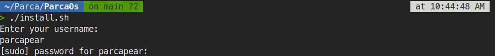
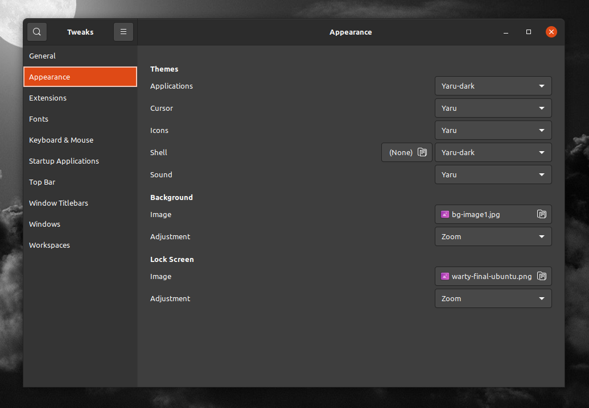
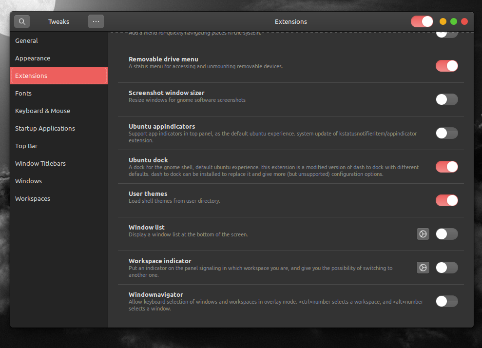

# Ubuntu post-install

I constantly make changes to my operating system, I enjoy looking for new options. I have tried arch, manjaro, ubuntu, mint, and a few other things. So I decided to do some "recovery" in a single script (bash). So this is what I have. I'd also like to mention that this script is under development so it may crash and throw errors. I am a web developer so this is kind of a "new world" for me.

### Install

To run this script first of all you need to clone this repository and rename it as ParcaOs.

```bash
# Install git
sudo apt-get install git -y

# Clone this directory. You must be in ~/ path
cd ~/
git clone https://github.com/parcapear/parca_recovery

# Rename the file parca_recovery as ParcaOs
mv ~/parca_recovery ~/ParcaOs

# Move to directory and give permissions to execute
cd ~/ParcaOs
sudo chmod +777 install.sh

# Run the execute
./install.sh
```

Now in your terminal, you must see a message about your username of ubuntu like this:

</img>

After entering your username. If you don't remember, just put the next command in your terminal:

```bash
# Let's check our username
echo $USER
```
And yeah, it will be all. Now just wait to complete the installation. In some cases, you will be a prompt open asking about an installation confirmation. Just put "ok" or "y", it depends on the situation.

### Customization
Now after installing completely, it's time to modify our UI. For that, we need to open our applications and search for "Tweaks", if you have your system in Spanish it could appear as "Retoques". We'll see something like this:

</img>

So here you have diferents options for customization. By the way, this recovery installed my personal theme.

| Section          | File              |
| ---------------- | ----------------- |
| **Applications** | Parcatheme        |
| **Cursor**       | Parcacursor       |
| **Icons**        | WhiteSur-red-dark |

After all, to activate our shell customization, we just need to go "Extensions" and activate [user-themes](https://extensions.gnome.org/extension/19/user-themes/)

</img>

At this point we select "Parcatheme" on Shell layer inside "Appearance" section and we finish.
